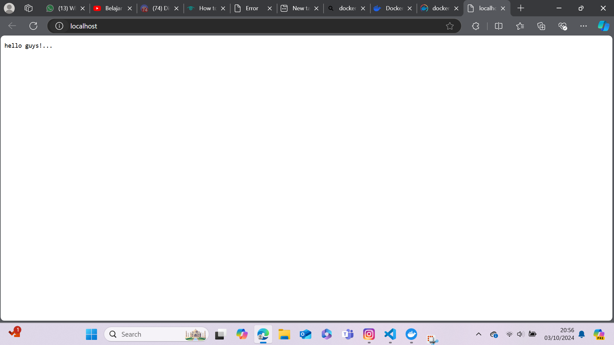

# Dokumentasi Tugas 1 PSS: Membuat Service Backend dan Reverse Proxy dengan NGINX dan Docker

## Deklarasikan project
``go mod init <nama-project>``
lalu buat file bernama main.go

Kemudian copy paste code berikut:

```
package main

import "net/http"

func main() {
	mux := http.NewServeMux()
	mux.Handle("/", &handler{})
	http.ListenAndServe(":8080", mux)
}

type handler struct {
}

func (h *handler) ServeHTTP(w http.ResponseWriter, r *http.Request) {
	w.Write([]byte("hello guys!..."))
}

```

## Membuat Image NGINX dan Golang

### Membuat image nginx
masukkan perintah ini di terminal: `docker pull nginx:<versi>`
lalu jalankan container dari image dengan perintah berikut:


### Membuat image go
buat file bernama `Dockerfile`
lalu masukkan perintah berikut ke dalam "Dockerfile"

```
# syntax=docker/dockerfile:1

FROM golang:1.22
WORKDIR /app
COPY go.mod ./
RUN go mod download
COPY *.go ./
# EXPOSE 8080
RUN go build -o main

CMD [ "./main" ]
```

lalu jalankan perintah berikut untuk membuat image aplikasi golang: 
`docker build -t <go-image:versi> <path_to_dockerfile>`


### Menyambungkan koneksi Container Nginx dan Aplikasi Golang
jalankan perintah berikut untuk membuat jaringan
`docker network create --driver <driver_name> <network_name>`


jalankan perintah berikut di terminal untuk membuat container nginx dan membuat koneksi ke network
`docker run --name <nginx-name> --network=<network_name> -p 80:80 nginx:<versi>`

jalankan perintah berikut di terminal untuk membuat container GOLANG dan membuat koneksi ke network
`docker run --name <go_apps> --network=<network_name> -p 8080:8080 go-image:<versi>`

## Konfigurasi Reverse Proxy NGINX

### Mengubah konfigurasi file nginx
jalankan perintah berikut untuk mendapatkan salinan file konfigurasi nginx:
``docker cp <nginx-name>:/etc/nginx/conf.d/default.conf ./default.conf``
lalu masukkan perintah berikut di file default.conf 
```
location / {
        proxy_pass http://<go_apps>:8080/;
    }
```
setelah itu copy file salinan default.conf ke container nginx dengan perintah berikut:
``docker cp ./default.conf <nginx-name>:/etc/nginx/conf.d/``

lalu reset nginx dengan menjalankan perintah berikut pada terminal
``sudo docker exec nginx-base nginx -t``
``sudo docker exec nginx-base nginx -s reload``

## Output
buka browser dan ketikkan url berikut ``http://localhost/``

kemudian anda akan melihat tampilan website seperti ini:
